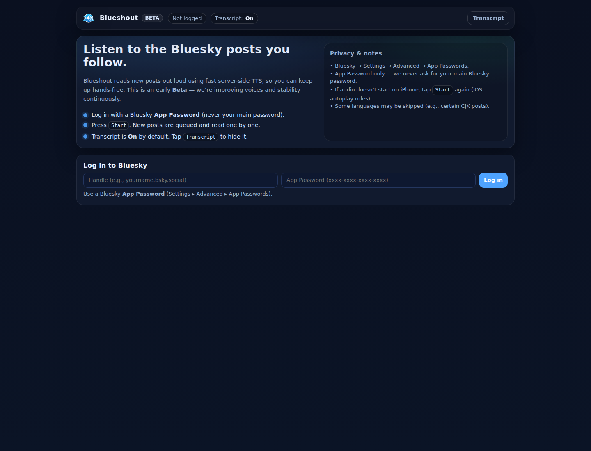

# Blueshout

<p align="center">
  
</p>

<p align="center">
  <strong>Listen to the Bluesky posts you follow.</strong>
</p>

<p align="center">
  <a href="https://blueshout.app/">Live Demo</a> |
  <a href="#features">Features</a> |
  <a href="#getting-started">Getting Started</a> |
  <a href="#roadmap">Roadmap</a> |
  <a href="#security">Security</a> |
  <a href="CHANGELOG.md">Changelog</a>
</p>

<p align="center">
  <a href="https://github.com/Eddienews/blueshout/actions/workflows/ci.yml">
    
  </a>
  
  
  
  
</p>

## Live Demo

Try Blueshout here: https://blueshout.app/

<p align="center">
  
</p>

## Why Blueshout

Bluesky timelines move quickly, and reading every post is not always practical when you are working, walking, cooking, or keeping another screen in focus. Blueshout turns followed posts into a lightweight audio queue so you can keep up hands-free.

The product goal is to make social reading feel calmer and more ambient: new posts come in, get read aloud, and remain visible in a clean transcript without requiring constant scrolling.

## Features

- Bluesky login using App Passwords
- Followed-post timeline polling through the AT Protocol API
- Server-side Piper text-to-speech generation
- Authenticated and rate-limited TTS endpoint
- Transcript cards in the browser
- Waiting music while no posts are queued
- Secure Flask sessions with only an opaque session id in the browser cookie
- Security headers for production deployments
- Responsive single-page interface

## Product Highlights

- Hands-free Bluesky listening experience for desktop and mobile browsers
- Privacy-conscious session design: Bluesky JWTs stay server-side
- App Password workflow that avoids asking for a main Bluesky password
- Simple Flask/Gunicorn deployment model suitable for small servers
- Open source setup with MIT license, CI, contribution guide, and security policy

## Tech Stack

- Python
- Flask
- Gunicorn
- Requests
- Piper TTS
- Bluesky AT Protocol XRPC APIs
- Vanilla HTML, CSS, and JavaScript
- GitHub Actions

## Getting Started

Create a virtual environment and install dependencies:

```bash
python3 -m venv .venv
. .venv/bin/activate
pip install -r requirements.txt
```

Create a local environment file:

```bash
cp .env.example .env
```

Edit `.env` and set a random `SECRET_KEY`. For local HTTP development, use:

```bash
SESSION_COOKIE_SECURE=0
```

Start the development server:

```bash
set -a
. ./.env
set +a
flask --app app run --host 127.0.0.1 --port 5000
```

Open http://127.0.0.1:5000 in your browser.

## Piper Setup

Install Piper separately and configure model paths with environment variables:

- `PIPER_BIN`
- `PIPER_MODELS_DIR`
- Optional per-language overrides such as `PIPER_PT`, `PIPER_EN`, and `PIPER_ES`
- Optional `PIPER_LANGUAGES` to expose additional language bases, for example `nl,pl,ja`
- Optional `PIPER_VOICES` for bulk model overrides, for example `nl=/opt/piper/models/nl_NL-mls-medium,pl=/opt/piper/models/pl_PL-darkman-medium`

The default configuration expects models under `/opt/piper/models`. Blueshout automatically reports the voices that are actually installed through `/api/tts_caps`, and the web app lets users choose between automatic language matching and installed voices.

## Deployment

A typical production deployment uses Gunicorn behind a reverse proxy:

```bash
gunicorn --workers 1 --threads 8 --timeout 180 -b 127.0.0.1:5000 app:app
```

For systemd deployments, point `EnvironmentFile` at a private `.env` file and do not commit that file.

Recommended production settings:

- Set `SECRET_KEY` to a strong random value
- Keep `SESSION_COOKIE_SECURE=1`
- Serve the app over HTTPS
- Keep `.env`, virtual environments, logs, and model files out of git
- Monitor CPU usage if TTS traffic grows

## Project Structure

- `app.py`: Flask backend, Bluesky API integration, session handling, and Piper TTS endpoint
- `index.html`: browser UI and client-side queue logic
- `static/`: logo and bundled waiting music
- `docs/`: README images and public documentation assets
- `.github/workflows/`: GitHub Actions CI
- `.env.example`: documented runtime configuration template

## Roadmap

- Add more bundled language presets and voice quality options
- Add richer queue controls for skipping, replaying, and pausing posts
- Add persistent server-side session/cache storage such as Redis
- Add automated browser smoke tests for the main UI
- Add deployment examples for Nginx, Apache, and systemd
- Add accessibility pass for keyboard navigation and screen reader labels

## Contributing

Contributions are welcome. Please read [CONTRIBUTING.md](CONTRIBUTING.md) before opening a pull request. Please also read [CODE_OF_CONDUCT.md](CODE_OF_CONDUCT.md).

## Security

If you find a vulnerability or accidentally discover sensitive data, please follow [SECURITY.md](SECURITY.md). Do not open public issues containing real Bluesky credentials, app passwords, JWTs, or production secrets.

## License

Blueshout is released under the [MIT License](LICENSE). All files in this repository, including the bundled logo and waiting-music assets, are licensed under MIT unless noted otherwise.
